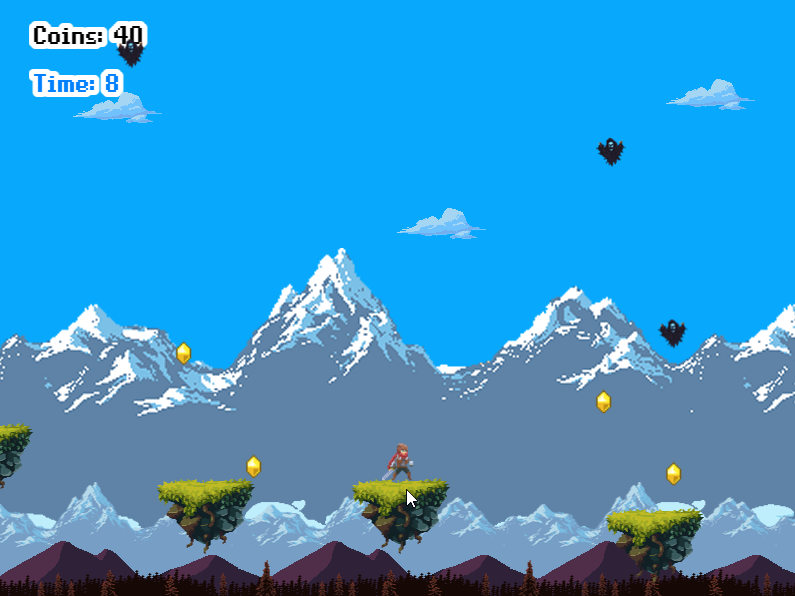

# Ice Warrior - Platform Game

You can find the project's requirements [here](https://www.notion.so/Platform-game-4a55a7d1fcc245bcb012c76814764712).

Kindly check my Game Design Document: [GDD](Game-design-document.md)

In this project I:

- Used Javascript and Phaser 3 to implement a Shooter Game.
- Used the following packages apart from the standard ones:
  - phaser
  - webpack
  - jest
- Set up ESlint in the repository.
- Created effective JavaScript code, that solved the problem.
- Used Webpack.
- Used ES6+.
- Dealt with async code.
- Tested the code using Jest.
- Sent and received data from a back-end endpoint.
- Used JSON format.
- Deployed the app to Netlify.
- Translated business requirements into software solutions.
- Communicated information effectively to technical people.

# How to play

- When the App is executed, you will see four buttons:
  - Start: Starts the game
  - Scores: Allows you to check the high scores leaderboard
  - Credits: Shows you the credits scene

- When the game starts, the story's intro will be played
- Then you will be able to control the warrior with up and right ARROW keys to move
- Try to collect as many coins as you can!
- If you get hit by a bat or fall off the platform, It will be game over.
- Get a bonus score if you pass all the platforms alive.

## Built with

- Javascript.
- Phaser 3.
- Jest.

## Live Demo

[Click here to see it on Netlify!](https://ice-warrior.netlify.app)

## Getting Started

- Clone the repository on your local machine
- Cd into the folder
- Install dependecies by running `npm install`
- Run `npm start`
- Open your browser and type `localhost:8080`

##  For testing

After runing 'npm install'
- In the terminal run 'npm run test'

## Installations

- Install VSCode or any code editor you like;
- Install npm by running `npm install`.

## Author

👤 **Eduardo Baeza**

- GitHub: [@edxco](https://github.com/edxco/)
- Twitter: [@lalo_nbc](https://twitter.com/lalo_nbc/)
- LinkedIn: [eduardo-n-baeza](https://www.linkedin.com/in/eduardo-n-baeza/)

## Acknowledgments

- [Microverse](https://www.microverse.org/).
- [itchio.io](https://itch.io/)

## 🤝 Contributing

Contributions, issues and feature requests are welcome! Start by:

- Forking the project
- Cloning the project to your local machine
- `cd` into the project directory
- Run `git checkout -b your-branch-name`
- Make your contributions
- Push your branch up to your forked repository
- Open a Pull Request with a detailed description to the development branch of the original project for a review

## Show your support

Give a ⭐️ if you like this project!